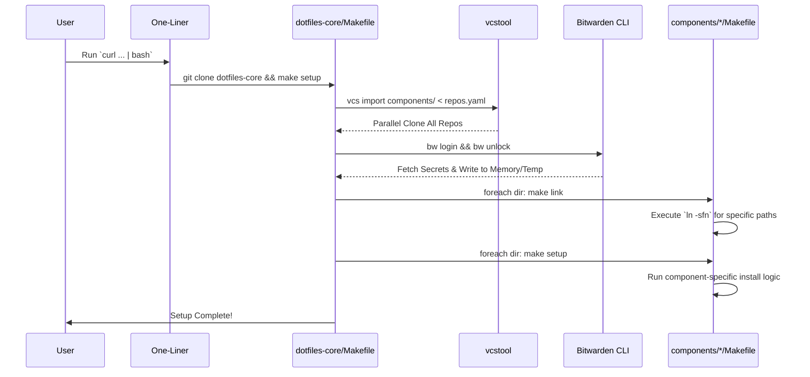

# Project Overview

本プロジェクトは、巨大化したモノレポの dotfiles を関心事ごとに複数のリポジトリに分割（Polyrepo化）し、バージョン管理の複雑さを解消することを目的とする。

Git Submodule による煩雑な管理を完全に排除し、「**メタ・リポジトリパターン（Meta-Repository Pattern）**」と「**フラット・レイアウト**」を採用。

まっさらな Ubuntu 環境から「1コマンド」で全リポジトリの取得・Bitwardenによるシークレットの解決・的確なシンボリックリンク展開までを自動化し、高度にモジュール化された開発環境を構築する。

## 🎯 Scope & Goals

* **対象OS**: Ubuntu (Linux) 専用
* **主要な分割リポジトリ（マイクロリポジトリ構成）**:
    機能ごとに独立したライフサイクルを持たせる。
    1. dotfiles-core: オーケストレーター（メタ・リポジトリ）。Makefile、repos.yaml、全体管理スクリプトのみを保持。
    2. dotfiles-system: システム共通の設定、パッケージリスト（apt/brew）、汎用スクリプト群
    3. dotfiles-zsh: Zsh関連設定（.zshrc, .zsh_env, カスタム関数, starship/p10k設定）
    4. dotfiles-vim: Neovim/Vim 関連設定（LazyVimベース等）
    5. dotfiles-git: Gitのグローバル設定および Lazygit 関連設定
    6. dotfiles-term: WezTerm, Tilix などのターミナルエミュレータ設定
    7. dotfiles-ide: VS Code などのIDE設定（settings.json, keybindings.json, 拡張機能リスト）
    8. dotfiles-ai: opencode, cursor, claude, gemini などのAIエージェント設定群
    9. dotfiles-gnome (Optional): GNOME拡張、ショートカット、dconf設定、Mozc等のOS依存GUI設定
* **シークレット管理**: bw (Bitwarden CLI) を使用した動的取得。ローカルへの平文シークレットファイルの手動配置を廃止する。

# Tech Stack

| Category | Technology / Tool | Version/Note |
| :---- | :---- | :---- |
| **OS** | Ubuntu | 22.04 / 24.04 LTS |
| **Orchestration** | GNU Make + Bash | dotfiles-core による統合処理と、各コンポーネントへの処理委譲 |
| **Repo Management** | vcstool | 複数リポジトリの並列一括クローン・プルをYAMLで宣言的に管理 |
| **Symlink Manager** | Makefile内での明示的な定義 | 柔軟なパス解決と冪等性のあるリンク (`ln -sfn`) をコンポーネント単位で実現 |
| **Secret Manager** | Bitwarden CLI (bw) | jq と組み合わせてJSONから安全に抽出 |

# Architecture

## Directory Structure (Meta & Component Layout)

親リポジトリである dotfiles-core の下に components/ ディレクトリを作成し、各サブコンポーネントをフラットに配置する。

```text
~/dotfiles/                     <-- [Repo: dotfiles-core] (Meta-Repository)
├── .gitignore                  <-- "components/" を除外
├── Makefile                    <-- メイン・ディスパッチャー
├── repos.yaml                  <-- vcstool用 リポジトリ定義
├── scripts/                    <-- 全体管理スクリプト
└── components/
    ├── dotfiles-system/        <-- [Repo: dotfiles-system]
    ├── dotfiles-zsh/
    ├── dotfiles-ai/            <-- [Repo: dotfiles-ai]
    │   ├── _mk/                <-- Makefile用サブモジュール (アンダースコアPrefix)
    │   ├── _bin/               <-- 実行可能スクリプト
    │   ├── _scripts/           <-- 内部ユーティリティ
    │   ├── _docs/
    │   ├── _tests/
    │   ├── commands/           <-- 設定実体
    │   ├── mcp/
    │   ├── skills/
    │   ├── claude/
    │   ├── opencode/
    │   ├── Makefile            <-- コンポーネント固有のリンク処理を記述
    │   ├── README.md
    │   └── AGENTS.md
    ├── dotfiles-vim/
    ├── dotfiles-term/
    ├── dotfiles-ide/
    ├── dotfiles-git/
    └── dotfiles-gnome/
```

**構成の意図:**

リポジトリ内部は、人間が見て最も直感的なドメイン駆動の構成とする。`_mk`や`_bin/`, `_scripts/` 等のシステム管理用ディレクトリには `_` (アンダースコア) を付与し、その他の設定実体と視覚的に分かりやすく分離する。

## Data Flow (Bootstrap Sequence)



# Features & Requirements

## Must Have (必須要件)

### 1. 1-Command Bootstrap

curl ワンライナーで、vcstool のインストールから全リポジトリの同期、リンク展開まで完了する。

### 2. Meta-Repository Pattern

vcstool と repos.yaml を使用し、堅牢で高速なリポジトリ同期（並列処理）を実現する。

### 3. Explicit Symlinking (明示的リンク方式)

各コンポーネント内の Makefile で `ln -sfn <source> <target>` をターゲットファイルごとに明示的に記述する。これにより予期せぬディレクトリのオートフォールディングやリンク漏れを防ぎ、リポジトリの自由なディレクトリ構造を許容する。

### 4. Idempotency (冪等性)

リンクを張る前に必要な親ディレクトリ（mkdir -p）を作成するなど、何度実行しても環境が壊れないロジックを実装する。

## Should Have (推奨要件)

### 1. Component Delegation

dotfiles-core の Makefile はただのディスパッチャーに徹し、make link や make setup の実態はすべて各コンポーネント（例: dotfiles-ai/Makefile）に委譲する。

### 2. Global DevContainer

個別のコンポーネントではなく、~/dotfiles（メタ・リポジトリ全体）をマウントする .devcontainer を dotfiles-core に配置し、横断的な開発体験を維持する。

# Data Structure

## Repository Manifest (repos.yaml)

vcstool が解釈するフォーマットで定義する。

```yaml
# repos.yaml
repositories:
  components/dotfiles-system:
    type: git
    url: git@github.com:yohi/dotfiles-system.git
    version: main
  components/dotfiles-gnome:
    type: git
    url: git@github.com:yohi/dotfiles-gnome.git
    version: main
  components/dotfiles-ai:
    type: git
    url: git@github.com:yohi/dotfiles-ai.git
    version: main
  components/dotfiles-ide:
    type: git
    url: git@github.com:yohi/dotfiles-ide.git
    version: main
  components/dotfiles-term:
    type: git
    url: git@github.com:yohi/dotfiles-term.git
    version: main
  components/dotfiles-git:
    type: git
    url: git@github.com:yohi/dotfiles-git.git
    version: main
  components/dotfiles-vim:
    type: git
    url: git@github.com:yohi/dotfiles-vim.git
    version: main
  components/dotfiles-zsh:
    type: git
    url: git@github.com:yohi/dotfiles-zsh.git
    version: main
```

# API Definition (Makefile Targets)

## Orchestrator (dotfiles-core/Makefile)

| Target | Description |
| :---- | :---- |
| make init | 依存関係（vcstool, jq 等）をインストールし、リポジトリを初期クローンする。 |
| make sync | vcs import components/ < repos.yaml 及び vcs pull で全コンポーネントを最新化する。 |
| make secrets | Bitwarden CLI を呼び出し、クレデンシャルをローカルに安全に展開する。 |
| make link | components/ 以下の全ディレクトリをループし、Makefile があれば make link を委譲する。 |
| make setup | components/ 以下の全ディレクトリをループし、Makefile があれば make setup を委譲する。 |

## Component Level (e.g., dotfiles-ai/Makefile)

各リポジトリは、自身の責任で以下のターゲットを実装する。

| Target | Description |
| :---- | :---- |
| make link | 自身のディレクトリ内のファイルを、OSの適切な場所（~/.config/opencodeなど）へ ln -sfn でリンクする。事前に mkdir -p を行うこと。 |
| make setup | リンク以外の初期化処理（例: パッケージのインストール、パーミッション変更等）を実行する。 |

# Refactoring & Migration Guidelines

各コンポーネントを独立させるにあたり、以下のリファクタリング戦略を厳守すること。

1. **自己完結したパス解決**:
   各コンポーネント内のスクリプトは、自身の位置を知るために `REPO_ROOT="$(cd "$(dirname "${BASH_SOURCE}")/.." && pwd)"` 等を使用し、ハードコードされた絶対パス（/home/user/dotfiles/...）を避ける。
2. **明示的なリンク定義**:
   make link 内では、必ずリンク先の親ディレクトリが存在することを保証する。
   例: `mkdir -p ~/.config/opencode && ln -sfn $(PWD)/opencode ~/.config/opencode/config`
3. **コンポーネント内の管理用ディレクトリの扱い**:
   `_bin/`, `_scripts/`, `_docs/`, `_mk/` などの `_` で始まるディレクトリはリポジトリの運用ツール・ドキュメントであり、明示的に `Makefile` で `ln -sfn` のターゲットとして指定しない限り、ユーザーのホームディレクトリ等にはリンクされない。Stow等による自動リンクのような副作用はないため、自由かつ機能的なディレクトリ名を使用してよいが、設定実体との区別のために `_` プレフィックスを推奨する。

# LLM Guidelines (AI向け実装ガイド)

この仕様書を読み込んでコードを生成するAIエージェントへの指示事項：

1. **vcs tool implementation**: make init および make sync の実装には、自前の git clone ループではなく、必ず vcs import と vcs pull を使用してください。
2. **Delegation Logic**: dotfiles-core/Makefile の link および setup ターゲットでは、以下のような Bash のループを記述して各コンポーネントに処理を委譲してください。

   ```bash
   @for dir in components/*; do \
       if [ -f "$$dir/Makefile" ]; then \
           $(MAKE) -C "$$dir" link || true; \
       fi \
   done
   ```

3. **Link Implementation**: 各コンポーネントの Makefile を生成・更新する際、標準の `ln -sfn` を使用してリンク処理を明示的に記述してください。リンク生成前には必ず `mkdir -p $(dirname $TARGET)` (または該当する展開先ディレクトリの作成) を実行し、冪等性を担保してください。
4. **Path Safety**: 全てのスクリプトにおいて、実行されるディレクトリカレントに依存しないよう cd "$(dirname "$0")" 等の防御的プログラミングを行ってください。
