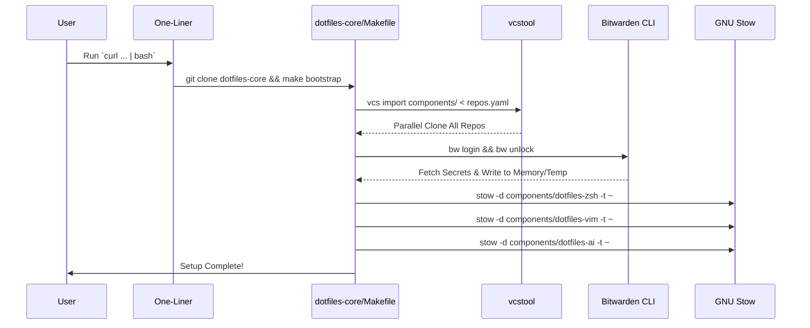

# Project Overview

本プロジェクトは、巨大化したモノレポの `dotfiles` を関心事ごとに複数のリポジトリに分割（Polyrepo化）し、バージョン管理の複雑さを解消することを目的とする。Git Submodule による煩雑な管理を完全に排除し、「メタ・リポジトリパターン（Meta-Repository Pattern）」と「フラット・レイアウト」を採用。まっさらな Ubuntu 環境から「1コマンド」で全リポジトリの取得・Bitwardenによるシークレットの解決・GNU Stowによるシンボリックリンク展開までを自動化し、高度にモジュール化された開発環境を構築する。

## 🎯 Scope & Goals

- **対象OS**: Ubuntu (Linux) 専用
- **主要な分割リポジトリ（マイクロリポジトリ構成）**: 機能ごとに独立したライフサイクルを持たせる。
  1. `dotfiles-core`: オーケストレーター（メタ・リポジトリ）。Makefile、repos.yaml、全体管理スクリプトのみを保持。
  2. `dotfiles-zsh`: Zsh関連設定（.zshrc, .zsh_env, カスタム関数, starship/p10k設定）
  3. `dotfiles-vim`: Neovim/Vim 関連設定（LazyVimベース等）
  4. `dotfiles-git`: Gitのグローバル設定および Lazygit 関連設定
  5. `dotfiles-term`: WezTerm, Tilix などのターミナルエミュレータ設定
  6. `dotfiles-ide`: VS Code などのIDE設定（settings.json, keybindings.json, 拡張機能リスト）
  7. `dotfiles-ai`: opencode, cursor, claude, gemini などのAIエージェント設定群
  8. `dotfiles-gnome` (Optional): GNOME拡張、ショートカット、dconf設定、Mozc等のOS依存GUI設定
- **シークレット管理**: bw (Bitwarden CLI) を使用した動的取得。ローカルへの平文シークレットファイルの手動配置を廃止する。

## Tech Stack

| Category | Technology / Tool | Version/Note |
| :--- | :--- | :--- |
| OS | Ubuntu | 22.04 / 24.04 LTS |
| Orchestration | GNU Make + Bash | dotfiles-core による統合処理 |
| Repo Management | vcstool | 複数リポジトリの並列一括クローン・プルをYAMLで宣言的に管理 |
| Symlink Manager | GNU Stow | ディレクトリ構造を維持したまま ~ へリンク |
| Secret Manager | Bitwarden CLI (bw) | jq と組み合わせてJSONから安全に抽出 |

## Architecture

### Directory Structure (Flat Layout)

Git Submodule特有の「親リポジトリへの誤コミット」を防ぐため、メタ・リポジトリである dotfiles-core の下に `components/` ディレクトリを作成し、各サブコンポーネントをフラット（並列）に配置する。

```text
~/dotfiles/                     <-- [Repo: dotfiles-core] (Meta-Repository)
├── .gitignore                  <-- "components/" を除外
├── Makefile                    <-- メイン・ディスパッチャー
├── repos.yaml                  <-- vcstool用 リポジトリ定義
├── scripts/                    <-- 全体管理スクリプト
└── components/                 <-- 各リポジトリのチェックアウト先
    ├── dotfiles-zsh/           <-- [Repo: dotfiles-zsh]
    ├── dotfiles-vim/           <-- [Repo: dotfiles-vim]
    ├── dotfiles-term/          <-- [Repo: dotfiles-term]
    ├── dotfiles-ide/           <-- [Repo: dotfiles-ide]
    ├── dotfiles-git/           <-- [Repo: dotfiles-git]
    ├── dotfiles-ai/            <-- [Repo: dotfiles-ai]
    └── dotfiles-gnome/         <-- [Repo: dotfiles-gnome]
```

### Data Flow (Bootstrap Sequence)



## Features & Requirements

### Must Have (必須要件)

1. **1-Command Bootstrap**: curl ワンライナーで、vcstool のインストールから全リポジトリの同期、Stow展開まで完了する。
2. **Meta-Repository Pattern**: 自作のループスクリプトではなく、Python製の vcstool と repos.yaml を使用し、堅牢で高速なリポジトリ同期（並列処理）を実現する。
3. **Dynamic Path Resolution**: モノレポ分割に伴い相対パスが破壊されるため、各コンポーネント内のスクリプトは `REPO_ROOT="$(cd "$(dirname "${BASH_SOURCE}")/.." && pwd)"` のように自身のパスを動的に解決する設計とする。
4. **Idempotency (冪等性)**: 複数回 make setup を実行しても環境が壊れない。

### Should Have (推奨要件)

1. **Component Delegation**: dotfiles-core の Makefile は巨大化させず、各コンポーネント（例: components/dotfiles-vim/Makefile）に setup ターゲットが存在する場合は、それに処理を委譲（Delegate）する。
2. **Global DevContainer**: 個別のコンポーネントではなく、~/dotfiles（メタ・リポジトリ全体）をマウントする .devcontainer を dotfiles-core に配置し、横断的な開発体験を維持する。

### Nice to Have (あると良い要件)

- lazygit 用のカスタムAIスクリプトなどは、dotfiles-git/bin/ に集約し、dotfiles-zsh 側でそのパスを $PATH に動的追加する疎結合な仕組み。

## Data Structure

### Repository Manifest (repos.yaml)

vcstool が解釈するフォーマットで定義する。親リポジトリである dotfiles-core 以外の全コンポーネントを記載する。

```yaml
# repos.yaml
repositories:
  components/dotfiles-gnome:
    type: git
    url: git@github.com:yohi/dotfiles-gnome.git
    version: main
  components/dotfiles-ai:
    type: git
    url: git@github.com:yohi/dotfiles-ai.git
    version: main
  components/dotfiles-ide:
    type: git
    url: git@github.com:yohi/dotfiles-ide.git
    version: main
  components/dotfiles-term:
    type: git
    url: git@github.com:yohi/dotfiles-term.git
    version: main
  components/dotfiles-git:
    type: git
    url: git@github.com:yohi/dotfiles-git.git
    version: main
  components/dotfiles-vim:
    type: git
    url: git@github.com:yohi/dotfiles-vim.git
    version: main
  components/dotfiles-zsh:
    type: git
    url: git@github.com:yohi/dotfiles-zsh.git
    version: main
```

## API Definition (Makefile Targets)

メインとなる dotfiles-core/Makefile は、ディスパッチャーとして以下のインターフェースを公開する。

| Target | Description |
| :--- | :--- |
| `make init` | 依存関係（vcstool, stow, jq 等）をインストールし、リポジトリを初期クローンする。 |
| `make sync` | vcs import components/ < repos.yaml 及び vcs pull で全コンポーネントを最新化する。 |
| `make secrets` | Bitwarden CLI を呼び出し、クレデンシャルをローカルに安全に展開する。 |
| `make link` | components/ 以下の全ディレクトリに対して GNU Stow を実行する。 |
| `make setup` | 上記を実行した後、各コンポーネント固有の make setup があれば呼び出し、委譲する。 |

## Refactoring & Migration Guidelines

各コンポーネントを独立させるにあたり、以下のリファクタリング戦略を厳守すること。

1. **AIエージェントへのパス永続化**: AGENTS.md 等が参照する絶対パス（例: ~/.config/opencode/...）を壊さないため、Stowによるシンボリックリンクの形成を絶対の前提とする。AI側の設定ファイルは書き換えない。
2. **シェル変数の注入**: Zsh環境において、かつてモノレポルートを指していた $DOTFILES_DIR の代わりに、`export DOTFILES_SHELL_ROOT="${0:a:h:h}"` のようなコンテキストパス解決を導入する。
3. **テストのコンテキスト適応**: 各種テストスクリプト（.sh）の `if [[ ! -f vim/init.lua ]]` のようなハードコードされたパスは禁止。スクリプト実行位置からの相対パス取得を利用する。

## LLM Guidelines (AI向け実装ガイド)

この仕様書を読み込んでコードを生成するAIエージェントへの指示事項：

1. **vcs tool implementation**: make init および make sync の実装には、自前の git clone ループではなく、必ず vcs import と vcs pull を使用してください。必要に応じて pip3 install vcstool などの導入ロジックも含めてください。
2. **GNU Stow in Flat Layout**: Stowを実行する際、ターゲットは ~ とし、dir は components/ 配下の各ディレクトリになるよう（例: `stow --restow --target=$HOME --dir=components/dotfiles-zsh .`）ループ処理を正しく記述してください。
3. **Makefile Delegation**: make setup 実行時、components/* をループし、その中に Makefile が存在し、かつ setup ターゲットが定義されている場合のみ `$(MAKE) -C $dir setup` を呼び出す Bash/Make ロジックを実装してください。
4. **Path Safety**: 全てのスクリプトにおいて、実行されるディレクトリカレントに依存しないよう `cd "$(dirname "$0")"` 等の防御的プログラミングを行ってください。
