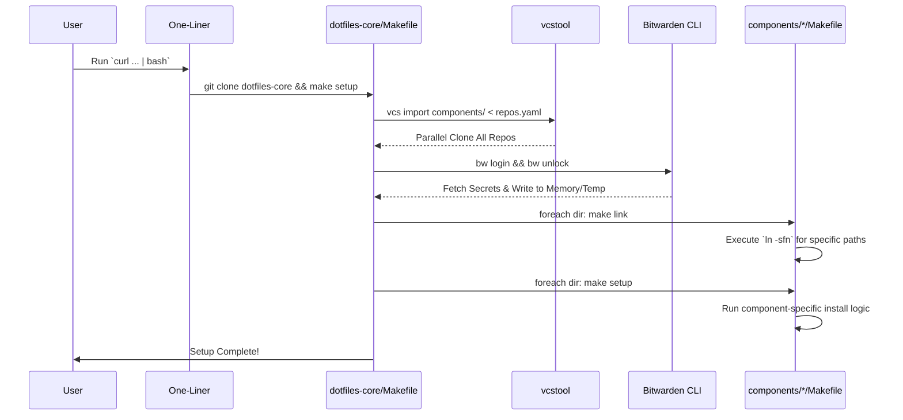
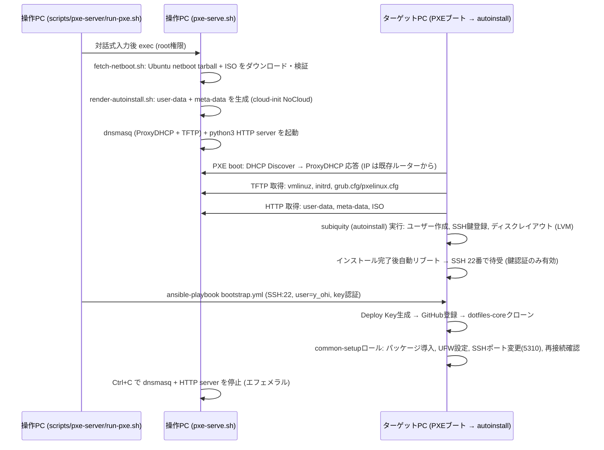
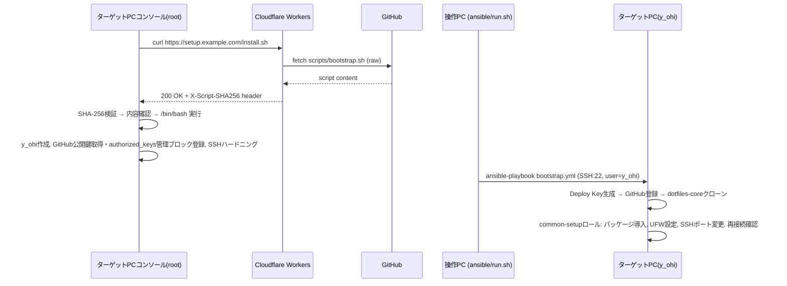
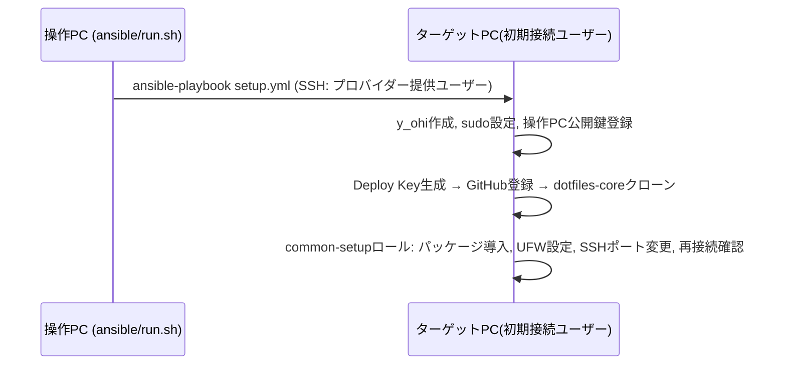

# Project Overview

本プロジェクトは、巨大化したモノレポの dotfiles を関心事ごとに複数のリポジトリに分割（Polyrepo化）し、バージョン管理の複雑さを解消することを目的とする。

Git Submodule による煩雑な管理を完全に排除し、「**メタ・リポジトリパターン（Meta-Repository Pattern）**」と「**フラット・レイアウト**」を採用。

まっさらな Ubuntu 環境から「1コマンド」で全リポジトリの取得・Bitwardenによるシークレットの解決・的確なシンボリックリンク展開までを自動化し、高度にモジュール化された開発環境を構築する。

## 🎯 Scope & Goals

* **対象OS**: Ubuntu (Linux) 専用
* **主要な分割リポジトリ（マイクロリポジトリ構成）**:
    機能ごとに独立したライフサイクルを持たせる。
    1. dotfiles-core: オーケストレーター（メタ・リポジトリ）。Makefile、repos.yaml、全体管理スクリプトのみを保持。
    2. dotfiles-system: システム共通の設定、パッケージリスト（apt/brew）、汎用スクリプト群
    3. dotfiles-zsh: Zsh関連設定（.zshrc, .zsh_env, カスタム関数, starship/p10k設定）
    4. dotfiles-vim: Neovim/Vim 関連設定（LazyVimベース等）
    5. dotfiles-git: Gitのグローバル設定および Lazygit 関連設定
    6. dotfiles-term: WezTerm, Tilix などのターミナルエミュレータ設定
    7. dotfiles-ide: VS Code などのIDE設定（settings.json, keybindings.json, 拡張機能リスト）
    8. dotfiles-ai: opencode, cursor, claude, gemini などのAIエージェント設定群
    9. dotfiles-gnome (Optional): GNOME拡張、ショートカット、dconf設定、Mozc等のOS依存GUI設定
* **シークレット管理**: bw (Bitwarden CLI) を使用した動的取得。ローカルへの平文シークレットファイルの手動配置を廃止する。
* **新規マシンの初期セットアップ**: まっさらな Ubuntu マシン（物理 PC / VPS）に対し、Ansible を用いて OS レベルの初期セットアップ（ユーザー作成、SSH ハードニング、dotfiles-core のクローン）を自動化する。
    * **物理 PC（推奨）**: 同一 LAN 上で `scripts/pxe-server/run-pxe.sh` を使った PXE 無人インストールを実行する。OS インストールからユーザー作成・SSH 鍵登録までを自動化し、SSH 接続可能な状態にする。
    * **物理 PC（レガシー/フォールバック）**: PXE が使えない環境では、ターゲット PC のコンソールでブートストラップスクリプト（`scripts/bootstrap.sh`）をダウンロードし、SHA-256 整合性検証と内容確認を行ったうえで実行する。
    * **VPS**: 操作 PC から Ansible のみで完結させる。

# Tech Stack

| Category | Technology / Tool | Version/Note |
| :---- | :---- | :---- |
| **OS** | Ubuntu | 22.04 / 24.04 / 26.04 LTS |
| **Orchestration** | GNU Make + Bash | dotfiles-core による統合処理と、各コンポーネントへの処理委譲 |
| **Repo Management** | vcstool | 複数リポジトリの並列一括クローン・プルをYAMLで宣言的に管理 |
| **Symlink Manager** | Makefile内での明示的な定義 | 柔軟なパス解決と冪等性のあるリンク (`ln -sfn`) をコンポーネント単位で実現 |
| **Secret Manager** | Bitwarden CLI (bw) | jq と組み合わせてJSONから安全に抽出 |
| **Provisioning** | Ansible | 新規Ubuntuマシン（物理PC/VPS）の初期セットアップ（ユーザー作成、SSHハードニング、UFW設定等） |
| **Script Distribution** | Cloudflare Workers | ブートストラップスクリプト (`scripts/bootstrap.sh`) をGitHub raw経由でHTTPS配信し、SHA-256整合性ヘッダーを付与 |

> [!NOTE]
> Ubuntu 26.04 のネットブート成果物（codename: `resolute`）は執筆時点で未検証です。`fetch_netboot()` は URL の到達性を確認し、存在しない場合は明確なエラーメッセージを返して即座に失敗します。

# Architecture

## Directory Structure (Meta & Component Layout)

親リポジトリである dotfiles-core の下に components/ ディレクトリを作成し、各サブコンポーネントをフラットに配置する。

```text
~/dotfiles/                     <-- [Repo: dotfiles-core] (Meta-Repository)
├── .gitignore                  <-- "components/" を除外
├── Makefile                    <-- メイン・ディスパッチャー
├── repos.yaml                  <-- vcstool用 リポジトリ定義
├── scripts/                    <-- 全体管理スクリプト (bootstrap.sh, pxe-server/, workers/)
└── components/
    ├── dotfiles-system/        <-- [Repo: dotfiles-system]
    ├── dotfiles-zsh/
    ├── dotfiles-ai/            <-- [Repo: dotfiles-ai]
    │   ├── _mk/                <-- Makefile用サブモジュール (アンダースコアPrefix)
    │   ├── _bin/               <-- 実行可能スクリプト
    │   ├── _scripts/           <-- 内部ユーティリティ
    │   ├── _docs/
    │   ├── _tests/
    │   ├── commands/           <-- 設定実体
    │   ├── mcp/
    │   ├── skills/
    │   ├── claude/
    │   ├── opencode/
    │   ├── Makefile            <-- コンポーネント固有のリンク処理を記述
    │   ├── README.md
    │   └── AGENTS.md
    ├── dotfiles-vim/
    ├── dotfiles-term/
    ├── dotfiles-ide/
    ├── dotfiles-git/
    └── dotfiles-gnome/
```

**構成の意図:**

リポジトリ内部は、人間が見て最も直感的なドメイン駆動の構成とする。`_mk`や`_bin/`, `_scripts/` 等のシステム管理用ディレクトリには `_` (アンダースコア) を付与し、その他の設定実体と視覚的に分かりやすく分離する。

## Data Flow (Bootstrap Sequence)


```mermaid
sequenceDiagram
    participant User
    participant CurlBash as One-Liner
    participant CoreMake as dotfiles-core/Makefile
    participant VCS as vcstool
    participant BW as Bitwarden CLI
    participant SubMake as components/*/Makefile

    User->>CurlBash: Run `curl ... | bash`
    CurlBash->>CoreMake: git clone dotfiles-core && make setup
    CoreMake->>VCS: vcs import components/ < repos.yaml
    VCS-->>CoreMake: Parallel Clone All Repos
    CoreMake->>BW: bw login && bw unlock
    BW-->>CoreMake: Fetch Secrets & Write to Memory/Temp
    CoreMake->>SubMake: foreach dir: make link
    SubMake->>SubMake: Execute `ln -sfn` for specific paths
    CoreMake->>SubMake: foreach dir: make setup
    SubMake->>SubMake: Run component-specific install logic
    CoreMake->>User: Setup Complete!
```

## Ubuntu Bootstrap Flow (新規マシンの初期セットアップ)

`make setup` を実行する前段階、つまり「まだ Ubuntu マシンがセットアップされていない」状態から SSH 接続可能な状態にするためのフロー。物理 PC と VPS で経路が異なる。

### 責務分離

ブートストラップスクリプト、PXE 無人インストール、Ansible の間では以下のように責務を分離する。

* **`scripts/pxe-server/` の責務 (推奨・物理 PC)**: 操作 PC 上で一時的に ProxyDHCP (dnsmasq) + TFTP + HTTP を起動し、Ubuntu Server の autoinstall (subiquity) を PXE ネットワークブートで配信する。OS インストール中にホスト名設定・ユーザー作成 (`y_ohi`)・SSH 公開鍵登録までを完了させ、`bootstrap.sh` で行っていた「SSH 接続の準備」フェーズを完全に自動化する。パスワードは `openssl passwd -6` でローカルハッシュ化されたもののみを使用し、平文は一切ディスクや argv に露出しない。
* **`scripts/bootstrap.sh` の責務 (レガシー・物理 PC)**: PXE が使えない環境でのフォールバック経路。手動 ISO インストール後のターゲット PC コンソール上で実行され、SSH 接続に必要な最小限の準備（ユーザー作成、GitHub 公開鍵取得・`authorized_keys` 管理ブロック登録、SSH ハードニング）のみを行う。PXE 経路ではユーザー作成・SSH 公開鍵登録は autoinstall、SSH ハードニングは Ansible (`common-setup` ロール) が担当するため、`bootstrap.sh` は PXE を使わない手動 ISO インストール時のみ使用される。
* **Ansible (`common-setup` ロール) の責務 (共通)**: SSH ポート変更、dotfiles-core のクローン、完全なパッケージインストール、ファイアウォール設定、GitHub Deploy Key の登録。`bootstrap.sh` や autoinstall の late-commands はこれらを一切実施しない。特に SSH ハードニング（`PermitRootLogin no` / `PasswordAuthentication no` / ポート変更）については Ansible が単一のソース・オブ・トゥルースとして担い、autoinstall の late-commands では重複させない。

### Directory Structure

```text
dotfiles-core/
├── scripts/
│   ├── bootstrap.sh              # 手動ISOインストール用ブートストラップスクリプト (レガシー, root実行, y_ohiユーザー作成/SSHハードニング)
│   ├── pxe-server/               # PXE無人インストールサーバースクリプト群 (操作PC上で実行)
│   │   ├── run-pxe.sh            # 対話式ランチャー (ansible/run.sh UX と同等)
│   │   ├── pxe-serve.sh          # エフェメラル PXE/TFTP/HTTP オーケストレータ (フォアグラウンド実行)
│   │   ├── fetch-netboot.sh      # Ubuntu netboot成果物の取得・検証スクリプト
│   │   ├── render-autoinstall.sh # user-data/meta-data レンダリングスクリプト
│   │   └── templates/            # envsubst テンプレート群 (dnsmasq.conf, grub.cfg, pxelinux.cfg, autoinstall.yaml, meta-data)
│   └── workers/
│       ├── install.js            # Cloudflare Workers 配信スクリプト (GitHub raw中継 + SHA-256ヘッダー付与)
│       ├── install.test.js       # Workers用テスト (Miniflare)
│       └── wrangler.toml         # Workers デプロイ設定
├── ansible/
│   ├── setup.yml                 # VPS用プレイブック (ゼロから全セットアップ)
│   ├── bootstrap.yml             # 物理PC用プレイブック (ブートストラップ/autoinstall後の本セットアップ)
│   ├── run.sh                    # 対話式セットアップランチャー (hosts.ini/vars.yml生成)
│   ├── hosts.ini / vars.yml      # 実行時生成されるインベントリ・変数ファイル
│   └── roles/common-setup/       # 両プレイブック共通の本セットアップタスク
├── tests/
│   ├── bootstrap/                # bootstrap.sh の Docker ベース回帰テスト
│   └── pxe-server/               # render-autoinstall.sh の Docker ベース回帰テスト
```

### Data Flow (物理PC — PXE無人インストール経路・推奨)


```mermaid
sequenceDiagram
    participant OperatorPC as 操作PC (scripts/pxe-server/run-pxe.sh)
    participant PXEServe as 操作PC (pxe-serve.sh)
    participant Target as ターゲットPC (PXEブート → autoinstall)

    OperatorPC->>PXEServe: 対話式入力後 exec (root権限)
    PXEServe->>PXEServe: fetch-netboot.sh: Ubuntu netboot tarball + ISO をダウンロード・検証
    PXEServe->>PXEServe: render-autoinstall.sh: user-data + meta-data を生成 (cloud-init NoCloud)
    PXEServe->>PXEServe: dnsmasq (ProxyDHCP + TFTP) + python3 HTTP server を起動
    Target->>PXEServe: PXE boot: DHCP Discover → ProxyDHCP 応答 (IP は既存ルーターから)
    Target->>PXEServe: TFTP 取得: vmlinuz, initrd, grub.cfg/pxelinux.cfg
    Target->>PXEServe: HTTP 取得: user-data, meta-data, ISO
    Target->>Target: subiquity (autoinstall) 実行: ユーザー作成, SSH鍵登録, ディスクレイアウト (LVM)
    Target->>Target: インストール完了後自動リブート → SSH 22番で待受 (鍵認証のみ有効)
    OperatorPC->>Target: ansible-playbook bootstrap.yml (SSH:22, user=y_ohi, key認証)
    Target->>Target: Deploy Key生成 → GitHub登録 → dotfiles-coreクローン
    Target->>Target: common-setupロール: パッケージ導入, UFW設定, SSHポート変更(5310), 再接続確認
    PXEServe->>PXEServe: Ctrl+C で dnsmasq + HTTP server を停止 (エフェメラル)
```

### Data Flow (物理PC — 手動ISOインストール経路・レガシー)


```mermaid
sequenceDiagram
    participant Console as ターゲットPCコンソール(root)
    participant Worker as Cloudflare Workers
    participant GitHub
    participant Operator as 操作PC (ansible/run.sh)
    participant Target as ターゲットPC(y_ohi)

    Console->>Worker: curl https://setup.example.com/install.sh
    Worker->>GitHub: fetch scripts/bootstrap.sh (raw)
    GitHub-->>Worker: script content
    Worker-->>Console: 200 OK + X-Script-SHA256 header
    Console->>Console: SHA-256検証 → 内容確認 → /bin/bash 実行
    Console->>Console: y_ohi作成, GitHub公開鍵取得・authorized_keys管理ブロック登録, SSHハードニング
    Operator->>Target: ansible-playbook bootstrap.yml (SSH:22, user=y_ohi)
    Target->>Target: Deploy Key生成 → GitHub登録 → dotfiles-coreクローン
    Target->>Target: common-setupロール: パッケージ導入, UFW設定, SSHポート変更, 再接続確認
```

### Data Flow (VPS)


```mermaid
sequenceDiagram
    participant Operator as 操作PC (ansible/run.sh)
    participant Target as ターゲットPC(初期接続ユーザー)

    Operator->>Target: ansible-playbook setup.yml (SSH: プロバイダー提供ユーザー)
    Target->>Target: y_ohi作成, sudo設定, 操作PC公開鍵登録
    Target->>Target: Deploy Key生成 → GitHub登録 → dotfiles-coreクローン
    Target->>Target: common-setupロール: パッケージ導入, UFW設定, SSHポート変更, 再接続確認
```

### Security Design

* **authorized_keys 管理ブロック**: GitHub から取得した公開鍵は `authorized_keys` 内の `dotfiles-bootstrap` 管理ブロックのみを置換し、ブロック外の手動追加鍵は再実行時も保持する。管理ブロックのマーカーが不整合な場合は既存ファイルを一切変更せずエラー終了する。一時ファイルへの書き込み後 `mv` で原子的に置換する。
* **GitHub Token の非永続化**: `github_token` は `vars.yml` やコマンド引数に保存せず、モード `0600` の一時 JSON ファイル経由で `--extra-vars @<file>` として渡す。Ansible タスクには `no_log: true` を設定し、`trap` で一時ファイルを必ず削除する。
* **SSH ハードニング**: `PermitRootLogin no`, `PasswordAuthentication no` を設定し、変更前後に `sshd -t` で構文検証、`sshd -T` で実効設定を確認する。
* **配信の真正性**: Cloudflare Workers はスクリプトの先頭バイト列とマーカー文字列を検証し、SHA-256 ヘッダーで転送中の破損を検出可能にする（配信元自体の真正性保証は範囲外）。
* **鍵検証の限界**: 公開鍵の形式検証（`ssh-keygen -l -f -` で解釈可能か）は、侵害された GitHub アカウントから返る形式上正しい鍵の真正性までは保証しない。
* **Deploy Key の非転送**: 物理 PC 用フローでは、ターゲット上で生成した Deploy Key の秘密鍵をターゲット外へ転送・表示しない。GitHub には公開鍵のみを read-only で登録する。

#### PXE フロー特有のセキュリティ設計

* **平文パスワードの非保持**: `hash_password_interactive()` は対話的に入力されたパスワードを `openssl passwd -6` で即座にハッシュ化し、平文をシェル変数からゼロクリアしてから stdout に出力する。ハッシュ値のみが autoinstall 設定ファイル（cloud-init NoCloud datasource の仕様によりファイル名は `user-data` でなければならない）に書き込まれ、平文は一切ディスクやプロセス引数に露出しない。
* **authorized_keys の二重検証**: オペレーター PC の SSH 公開鍵ファイルと GitHub から取得した鍵は、いずれも `scripts/bootstrap.sh` 由来の `validate_pubkeys()` を通じて形式・内容を検証する。
* **Zero-key Lockout Guard**: `build_ssh_keys_yaml()` は、オペレーター鍵ファイルが空・不正で、かつ GitHub 鍵も取得できない場合に autoinstall 設定を生成せずにエラー終了する。`allow-pw: false`（パスワード認証無効）とゼロ鍵の組み合わせによるマシンロックアウトを防ぐ。
* **netboot 成果物の動的解決**: `fetch_netboot()` は Ubuntu のポイントリリースによる可変ファイル名（例: `ubuntu-24.04.4-live-server-amd64.iso` および `ubuntu-24.04.4-netboot-amd64.tar.gz`）を HTML ディレクトリリスティングから動的に抽出する。固定名を推測して古いバージョンや存在しないファイルをダウンロードするリスクを回避する。
* **PXE 成果物の整合性検証境界**: ISO ファイル（例: `ubuntu-24.04.4-live-server-amd64.iso`）は Ubuntu 公式に公開された SHA-256 チェックサムと照合する。netboot tarball（例: `ubuntu-24.04.4-netboot-amd64.tar.gz`）には公開されたチェックサムエントリが存在しないため、アーカイブの整合性検証（`tar` 展開テストなど）のみを行う。これは転送・保存中の破損を検出できるが、配布元の真正性を保証するものではない。

### Testing Strategy

* `scripts/bootstrap.sh`: Docker コンテナ（`tests/bootstrap/`）上で authorized_keys マージロジックの回帰テストを行う。
* `scripts/pxe-server/render-autoinstall.sh`: Docker コンテナ（`tests/pxe-server/`）上で user-data / meta-data のレンダリング、YAML 構文検証、パスワードハッシュ埋め込み、Zero-key Lockout Guard の回帰テストを行う。
* `scripts/pxe-server/fetch-netboot.sh`: ネットワークアクセス（ISO は約3GB）が必要なため Docker 回帰テストの対象外とし、手動スモークテストでダウンロード・検証・冪等性を確認する。

### Out of Scope (今後の拡張)

* 別経路で配布する固定チェックサムまたはスクリプト内容の署名による、配信元（Cloudflare Workers）自体の真正性検証。
* ブートストラップ完了後の自動通知（Slack 等）。
* 他のクラウドプロバイダー（AWS EC2, Azure VM 等）への対応。

# Features & Requirements

## Must Have (必須要件)

### 1. 1-Command Bootstrap

curl ワンライナーで、vcstool のインストールから全リポジトリの同期、リンク展開まで完了する。

### 2. Meta-Repository Pattern

vcstool と repos.yaml を使用し、堅牢で高速なリポジトリ同期（並列処理）を実現する。

### 3. Explicit Symlinking (明示的リンク方式)

各コンポーネント内の Makefile で `ln -sfn <source> <target>` をターゲットファイルごとに明示的に記述する。これにより予期せぬディレクトリのオートフォールディングやリンク漏れを防ぎ、リポジトリの自由なディレクトリ構造を許容する。

### 4. Idempotency (冪等性)

リンクを張る前に必要な親ディレクトリ（mkdir -p）を作成するなど、何度実行しても環境が壊れないロジックを実装する。

## Should Have (推奨要件)

### 1. Component Delegation

dotfiles-core の Makefile はただのディスパッチャーに徹し、make link や make setup の実態はすべて各コンポーネント（例: dotfiles-ai/Makefile）に委譲する。

### 2. Global DevContainer

個別のコンポーネントではなく、~/dotfiles（メタ・リポジトリ全体）をマウントする .devcontainer を dotfiles-core に配置し、横断的な開発体験を維持する。

## Ubuntu Bootstrap Automation (新規マシン初期セットアップ)

### 1. Dual-Path Provisioning

物理 PC（コンソールアクセスのみ）と VPS（SSH直接アクセス可）で異なる初期化経路を提供する。

* **物理 PC（推奨）**: 同一 LAN 上で `scripts/pxe-server/run-pxe.sh` を使った PXE 無人インストールを実行する。操作 PC 上でエフェメラルな PXE/TFTP/HTTP サーバーを起動し、Ubuntu Server autoinstall (subiquity) 経由でユーザー作成・SSH 鍵登録までを自動化する。PXE ブートはレガシー BIOS（PXELINUX）と UEFI（GRUB）の双方をサポートする。
* **物理 PC（フォールバック）**: PXE が使えない環境では、ターゲット PC のコンソールでブートストラップスクリプト（`scripts/bootstrap.sh`）を Cloudflare Workers 経由でダウンロードし、SHA-256 整合性検証と内容確認を行ったうえで実行する。
* **VPS**: 操作 PC から Ansible のみで完結させる。

### 2. Idempotent authorized_keys Merge

GitHub から取得した公開鍵を `authorized_keys` の管理ブロックのみ置換し、手動追加鍵を保持する冪等なマージロジックを実装する。

### 3. Secretless Token Handling

GitHub Personal Access Token を `vars.yml` や Ansible ログに残さず、一時ファイル経由で安全に受け渡す。

# Data Structure

## Repository Manifest (repos.yaml)

vcstool が解釈するフォーマットで定義する。

```yaml
# repos.yaml
repositories:
  components/dotfiles-system:
    type: git
    url: git@github.com:yohi/dotfiles-system.git
    version: main
  components/dotfiles-gnome:
    type: git
    url: git@github.com:yohi/dotfiles-gnome.git
    version: main
  components/dotfiles-ai:
    type: git
    url: git@github.com:yohi/dotfiles-ai.git
    version: main
  components/dotfiles-ide:
    type: git
    url: git@github.com:yohi/dotfiles-ide.git
    version: main
  components/dotfiles-term:
    type: git
    url: git@github.com:yohi/dotfiles-term.git
    version: main
  components/dotfiles-git:
    type: git
    url: git@github.com:yohi/dotfiles-git.git
    version: main
  components/dotfiles-vim:
    type: git
    url: git@github.com:yohi/dotfiles-vim.git
    version: main
  components/dotfiles-zsh:
    type: git
    url: git@github.com:yohi/dotfiles-zsh.git
    version: main
```

# API Definition (Makefile Targets)

## Orchestrator (dotfiles-core/Makefile)

| Target | Description |
| :---- | :---- |
| make init | 依存関係（vcstool, jq 等）をインストールし、リポジトリを初期クローンする。 |
| make sync | vcs import components/ < repos.yaml 及び vcs pull で全コンポーネントを最新化する。 |
| make secrets | Bitwarden CLI を呼び出し、クレデンシャルをローカルに安全に展開する。 |
| make link | components/ 以下の全ディレクトリをループし、Makefile があれば make link を委譲する。 |
| make setup | components/ 以下の全ディレクトリをループし、Makefile があれば make setup を委譲する。 |

## Component Level (e.g., dotfiles-ai/Makefile)

各リポジトリは、自身の責任で以下のターゲットを実装する。

| Target | Description |
| :---- | :---- |
| make link | 自身のディレクトリ内のファイルを、OSの適切な場所（~/.config/opencodeなど）へ ln -sfn でリンクする。事前に mkdir -p を行うこと。 |
| make setup | リンク以外の初期化処理（例: パッケージのインストール、パーミッション変更等）を実行する。 |

# Refactoring & Migration Guidelines

各コンポーネントを独立させるにあたり、以下のリファクタリング戦略を厳守すること。

1. **自己完結したパス解決**:
   各コンポーネント内のスクリプトは、自身の位置を知るために `REPO_ROOT="$(cd "$(dirname "${BASH_SOURCE}")/.." && pwd)"` 等を使用し、ハードコードされた絶対パス（/home/user/dotfiles/...）を避ける。
2. **明示的なリンク定義**:
   make link 内では、必ずリンク先の親ディレクトリが存在することを保証する。ディレクトリ全体をリンクする場合と、特定のファイルやディレクトリを別名でリンクする場合がある。
   例: `mkdir -p ~/.config/opencode && ln -sfn $(PWD)/opencode ~/.config/opencode/config` （この例では、リポジトリ内の `opencode` ディレクトリを `~/.config/opencode/config` という名前で、親ディレクトリ作成後にリンクしている）
3. **コンポーネント内の管理用ディレクトリの扱い**:
   `_bin/`, `_scripts/`, `_docs/`, `_mk/` などの `_` で始まるディレクトリはリポジトリの運用ツール・ドキュメントであり、明示的に `Makefile` で `ln -sfn` のターゲットとして指定しない限り、ユーザーのホームディレクトリ等にはリンクされない。Stow等による自動リンクのような副作用はないため、自由かつ機能的なディレクトリ名を使用してよいが、設定実体との区別のために `_` プレフィックスを推奨する。

# LLM Guidelines (AI向け実装ガイド)

この仕様書を読み込んでコードを生成するAIエージェントへの指示事項：

1. **vcs tool implementation**: make init および make sync の実装には、自前の git clone ループではなく、必ず vcs import と vcs pull を使用してください。
2. **Delegation Logic**: dotfiles-core/Makefile の link および setup ターゲットでは、以下のような `find` と `while read` を組み合わせた Bash ループを記述して、各コンポーネントに処理を委譲してください。ディレクトリ名にスペースが含まれていても安全に処理し、且つターゲットが存在するか `--dry-run` (`-n`) で確認した上で実行します。 failures は無視せず、合計をカウントして非ゼロで終了するようにしてください。

   ```bash
   @if [ -d "$(COMPONENTS_DIR)" ]; then \
       fail_count=0; \
       total_count=0; \
       while IFS= read -r -d '' dir; do \
           if [ -f "$$dir/Makefile" ]; then \
               if $(MAKE) -C "$$dir" -n link >/dev/null 2>&1; then \
                   total_count=$$((total_count + 1)); \
                   if ! $(MAKE) -C "$$dir" link; then \
                       fail_count=$$((fail_count + 1)); \
                   fi; \
               fi; \
           fi; \
       done < <(find "$(COMPONENTS_DIR)" -maxdepth 1 -mindepth 1 -type d -print0); \
       if [ $$fail_count -gt 0 ]; then exit 1; fi; \
   fi
   ```

3. **Link Implementation**: 各コンポーネントの Makefile を生成・更新する際、標準の `ln -sfn` を使用してリンク処理を明示的に記述してください。リンク生成前には必ず `mkdir -p $(dirname $TARGET)` (または該当する展開先ディレクトリの作成) を実行し、冪等性を担保してください。
4. **Path Safety**: 全てのスクリプトにおいて、実行されるディレクトリカレントに依存しないよう cd "$(dirname "$0")" 等の防御的プログラミングを行ってください。
